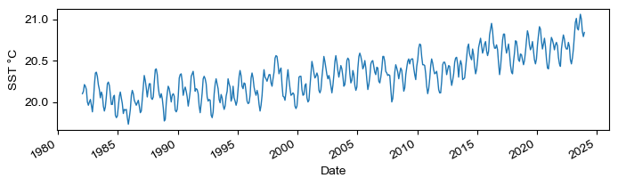

# Visually Assisted Singular Spectrum AnaLysis (VASSAL)

> [!NOTE]
> This repository contains an early development version of VASSAL, designed
> for educational purposes. VASSAL has undergone extensive testing with the
> pytest framework; however, users may report any experienced issues using
> [GitHub Issues](https://github.com/ADSCIAN/vassal/issues).

## Overview

The `vassal` Python package implements the basic Singular Spectrum
Analysis (SSA) univariate timeseries decomposition technique, relying on
different Singular Value Decomposition (SVD) methods from existing Python
scientific packages. It also provides a convenient API along with plotting
capabilities.

## Installation

```bash
pip install vassal
```

## Hands-on with SSA

SSA is a great time series decomposition technique typically used to explore
a signal and separate its deterministic components (e.g., trend or seasonality)
from noise [1,2].

FIGURE

The univariate basic SSA algorithm is a three-step process
involving (i) the construction of a two-dimensional matrix from the time series
using time-delayed embedding, (ii) the decomposition of the matrix using
Singular Value Decomposition (SVD), and (iii) the selection and reconstruction
of the components of interest.

### Datasets

The `vassal` python package is battery-included, providing datasets to
experience with the implemented classes and methods. The datasets are loaded
and parsed into a [
`pandas.DataFrame`](https://pandas.pydata.org/pandas-docs/stable/reference/api/pandas.DataFrame.html)
object.

| Dataset   | Loading Function   | Description                                                                | Time Range               | Source                                                            | License   |
|-----------|--------------------|----------------------------------------------------------------------------|--------------------------|-------------------------------------------------------------------|-----------|
| Mortality | `load_mortality()` | Daily counts of deaths in Belgium.                                         | 1992-01-01 to 2023-12-31 | [STATBEL](https://statbel.fgov.be/en/open-data/number-deaths-day) | Open Data |
| SST       | `load_sst()`       | Monthly mean sea surface temperature globally between 60° North and South. | 1982-01-01 to 2023-12-31 | [Climate Reanalyzer](https://climatereanalyzer.org/)              | CC-BY     |
| Sunspots  | `load_sunspots()`  | Monthly mean total sunspot number.                                         | 1749-01 to 2023-12       | [Royal Observatory of Belgium](https://www.sidc.be/SILSO/)        | CC-BY-NC  |

```python
from vassal.datasets import load_sst

ts = load_sst()
ts.plot(figsize=(8, 2), ylabel='SST °C', lw=1.)
```



### Step 1: Time-delayed Embedding

For step (i), two main approaches have been proposed. The Broomhead & Kink (BK)
consists of building a trajectory matrix of unit lags [3], while the Vautard &
Ghil (VG) proposes using a lagged covariance matrix for decomposition [4].
The `vassal` python package provides both implementations, using the BK approach
as default. The BK and VG approaches depend on a `window` parameter defining
the maximum lag, with the default value being set to the half length of the
time series.

The code snippet below shows how to instantiate a `SingularSpectrumAnalyis`
object while changing the matrix type and manually setting the window length.

```python
from vassal import SingularSpectrumAnalysis as SSA

ssa = SSA(ts, svd_matrix='VG', window=len(ts)//3)
```
### Step 2: SVD Decomposition

Regarding step (ii), many existing SVD implementations vary in
accuracy, hypotheses on the underlying structure of the decomposed matrix,
and computational performance. The `vassal` Python package wraps existing methods
implemented in Python scientific packages (See [SVD Methods](#svd-methods)).
Most SSA's limitations pertain to SVD's limitations and some advanced
SSA approaches implement alternative decomposition methods beyond the
current scope of `vassal`.

Using `vassal`, you can select a particular SVD solver while instantiating a 
`SingularSpectrumAnalyis` object. By default, `vassal` relies on the
[numpy.linalg.svd](https://numpy.org/doc/2.0/reference/generated/numpy.linalg.svd.html)
method. In the example, we show an alternative using a wrapper to 
the [sklearn Truncated SVD](https://scikit-learn.org/stable/modules/generated/sklearn.decomposition.TruncatedSVD.html),
based on a randomized SVD algorithm [5]. This solver is recommended for 
speed performance for time series as its length increases.

```python
from vassal import SingularSpectrumAnalysis as SSA

ssa = SSA(ts, svd_solver = 'sk_rsvd')
ssa.decompose(n_components=20)
```


### Selection and Reconstruction

Lastly, the selection step (iii) is typically manually supervised yet
supported by visualizations of the decomposed features, i.e., singular values
and vectors (See [Visualization](#visualization)]. The `vassal` python package
proposes some of the standard plotting features inspired by the `rSSA` R
package [6]. Selected components are reconstructed using linear algebra and
transformed back into a time series by leveraging the structural properties of
the original matrix. In general, the manual selection of components turns SSA
into an exploratory and empirical approach, relying on subjective, user-defined
criteria. While no all-purpose solution exists, many automated selection
methods are proposed in the literature, e.g., grouping singular components
based on their relative norms or associated frequencies [e.g., 6].

| `kind`       | Description                                               | Decomposition Required | Reconstruction Required |
|--------------|-----------------------------------------------------------|:----------------------:|:-----------------------:|
| `paired`     | Plot pairs (x,y) of successive left-eigenvectors          |          Yes           |           No            |
| `timeseries` | Plot original, preprocessed, or reconstructed time series |        Optional        |        Optional         |
| `values`     | Plot the singular values                                  |          Yes           |           No            |
| `vectors`    | Plot the left eigen vectors                               |          Yes           |           No            |
| `wcorr`      | Plot the weighted correlation matrix                      |          Yes           |           No            |

### Going Further


### Embedding Methods

The `vassal` package supports univariate time-series decomposition relying on
the
SVD of a lagged trajectory matrix (Broomhead & King, 1986). The lagged
Trajectory matrix is built using a window size parameter window:

```python
from vassal import SingularSpectrumAnalysis
from vassal.datasets import load_sst

sst = load_sst()  # Sea Surface Temperature
ssa = SingularSpectrumAnalysis(sst, window=100)
ssa.svd_matrix
```

### SVD methods

By default, `vassal` depends on the NumPy implementation of SVD, yet, provides
alternative algorithms, including truncated SVD algorithms for speed
performance.

| `svd_solver` |   |   |   |
|-------------|---|---|---|
| `np_svd`    | [`numpy.linalg.svd`](https://numpy.org/doc/stable/reference/generated/numpy.linalg.svd.html)  |   |   |
|             |   |   |   |
|             |   |   |   |
|             |   |   |   |
|             |   |   |   |

* 
* [
  `scipy.linalg.svd`](https://docs.scipy.org/doc/scipy/reference/generated/scipy.linalg.svd.html)
* [
  `scipy.sparse.linalg.svds`](https://docs.scipy.org/doc/scipy/reference/generated/scipy.sparse.linalg.svds.html)
* [
  `sklearn.utils.extmath.randomized_svd`](https://scikit-learn.org/stable/modules/generated/sklearn.utils.extmath.randomized_svd.html)
* [
  `dask.array.linalg.svd`](https://docs.dask.org/en/stable/generated/dask.array.linalg.svd.html) (
  optional)
* [
  `dask.array.linalg.svd_compressed`](https://docs.dask.org/en/latest/generated/dask.array.linalg.svd_compressed.html) (
  optional)

### Visualization

The `SingularSpectrumAnalysis` class has a `plot` method allowing for multiple
plot `kind`. Some p


## References

1. Golyandina, N., & Zhigljavsky, A. (2020). Singular Spectrum Analysis for Time
   Series. Berlin, Heidelberg:
   Springer. https://doi.org/10.1007/978-3-662-62436-4
2. Hassani, H. (2007). Singular Spectrum Analysis: Methodology and Comparison.
   Journal of Data Science, 5(2),
   239–257. https://doi.org/10.6339/JDS.2007.05(2).396
3. Broomhead, D. S., & King, G. P. (1986). Extracting qualitative dynamics from
   experimental data. Physica D: Nonlinear Phenomena, 20(2),
   217–236. https://doi.org/10.1016/0167-2789(86)90031-X
4. Vautard, R., & Ghil, M. (1989). Singular spectrum analysis in nonlinear
   dynamics, with applications to paleoclimatic time series. Physica D:
   Nonlinear Phenomena, 35(3),
5. Halko, N., Martinsson, P.-G., & Tropp, J. A. (2010, December 14). Finding structure with randomness: Probabilistic   
   algorithms for constructing approximate matrix decompositions. arXiv. https://doi.org/10.48550/arXiv.0909.4061
   395–424. https://doi.org/10.1016/0167-2789(89)90077-8
6. Golyandina, N., & Zhigljavsky, A. (2020). Singular Spectrum Analysis for Time
   Series. Berlin, Heidelberg:
   Springer. https://doi.org/10.1007/978-3-662-62436-4
7. Allen, M. R., & Smith, L. A. (1996). Monte Carlo SSA: Detecting irregular
   oscillations in the Presence of Colored Noise. Retrieved
   from https://journals.ametsoc.org/view/journals/clim/9/12/1520-0442_1996_009_3373_mcsdio_2_0_co_2.xml


